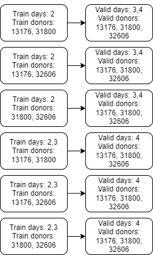

# 7th place solution

## CV Scheme

Since the organizer initially provided the information how public and
private parts are splitted, we decided to utilize this info and design
our local validation as similar as possible to the private part. So, we
can say that the public part of the leaderboard was of little interest
to us.

The validation scheme is shown in the picture below (for citeseq part).
Since we have three days in train dataset (citeseq task), the number of
splits equals 6, for the multiome part the scheme was the same. However,
there were 9 splits due to the larger number of days (at the very end we
slightly modified this scheme so that validation fold always contained
only one (nearest) day).

## How to submit

Since the last available day (in train dataset) was always in validation
folds, we could not use this validation scheme for the traditional folds
blending. So, when we wanted to make submit, we used the usual KFold
validation with shuffle. The approach was the following: all hypotheses
and experiments, including hyperparameters tuning, were tested on true
cv and afterwards these models were retrained on KFold.

## Features and dimensionality reduction

We used PCA for dimensionality reduction for both tasks. Autoencoder was
tested on citeseq dataset too, but performed slightly worse than PCA. We
also used “important” features in their raw form for citeseq task.
Moreover we created some additional features based on aggregations of
“important” columns over metadata (for example,
“mean_feature_1\_by_donor”). Such features gave us + 0.0003 for GBDT
model on local CV.

## Models (ensemble)

- *Citeseq task* : 3x multilayer perceptrons, 1x Conv1D, 1x pyBoost
  (best single model).
- *Multiome task* : 1x multilayer perceptron, 1x TabNet, 1x pyBoost
  (best single model).

pyBoost seems to be the new SOTA on multioutput tasks (at least among
GBDT models). It’s extremely fast to train as it uses GPU only and super
easy to customize.

[Paper](https://openreview.net/forum?id=WSxarC8t-T)

[Code](https://github.com/sb-ai-lab/Py-Boost)

## Some remarks about models

- *Multiome task*: all neural nets had 23418 output neurons. For pyBoost
  we reduced targets’ dimension to 64 components using PCA.

- pyBoost was the best single model on True CV and KFold validation on
  citeseq data.

- For multiome task, it was the best model according to True CV and the
  worst by KFold.

- We noticed that splitting targets into groups and building a separate
  pyBoost model for each group improved our local CV a lot. By default,
  pyBoost can split targets into groups randomly, so we decided to try
  to improve it by splitting targets into groups based on their
  clusters, however, in the end it worked nearly the same as random
  splitting.

## Data used to train

- *Citeseq task* : all available data
- *Multiome task* : day 7 data only.

Solving multiome task, we noticed that there is a significant
performance drop on day 7 (on True CV). There was an idea that the
reason is data drift in time, so we tried to train the model not on all
available days, but only on the last available one. Locally, this
improved our score by + 0.02. However, the problem was that there were
no unseen days on the public leaderboard, so training the model only on
the last available day seriously dropped our public score (from 0.814 to
0.808). Nevertheless, we decided to follow the mantra “trust your cv”
and as a result, this particular submission became our best on private.

We also conducted a study on the similarity of days and found out that
among available training days, day 3 is the most similar to private day
10 (day 7 is the second most similar). Nevertheless, since for other
days the most similar day was always the closest in time, we decided to
train our models on day 7.
