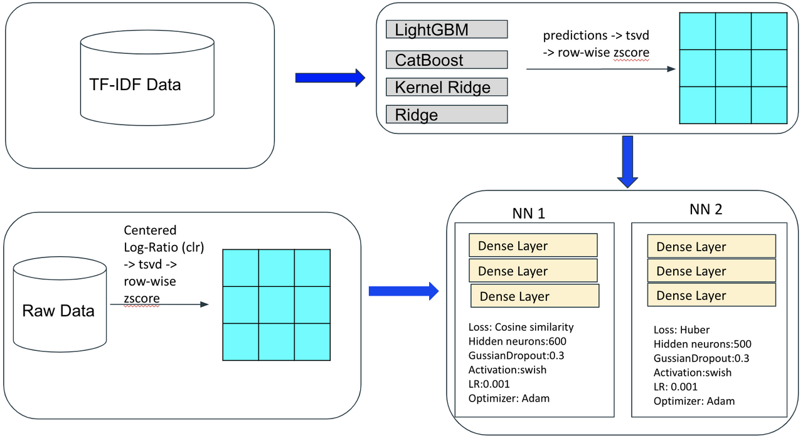

# 2nd place solution

You can find the code on github
[here](https://github.com/senkin13/kaggle/tree/master/Open-Problems-Multimodal-Single-Cell-Integration-2nd-Place-Solution)

## Overview

### CITEseq

### Multiome

## preprocessing

1.  centered log ratio transformation (CLR) is the best normalization
    method for both of cite and multi, I found the method from nature
    articles. <https://www.nature.com/articles/s41467-022-29356-8>

2.  high correlation raw features with target

3.  [@baosenguo](https://www.kaggle.com/baosenguo) designed fine tuned
    process

using raw count: normalization:sample normalization by mean values over
features transformation:sqrt transformation standardization:feature
z-score batch-effect correction:take “day” as batch, for each batch, we
calculate the column-wise median to get a “median-sample” representing
the batch, and then subtract this sample from each sample in this batch.
This method may not bring much improvement, but it is simple enough to
avoid risks.

4.  row-wise zscore transformation before input to neural network

## validation

The biggest challenge in this competition is how to build a robust model
for unseen donor in public test and unseen day&donor in private test. At
the early stage I used random kfold, cross validation and LB score
matched very well, so we don’t need to worry about donor domain
shift.But time domain shift is unpredictable, after team merge, we check
our features one by one with out-of-day validation(groupkfold by day) to
make sure all the features can improve every day.

## Model

- Lightgbm

train 4 lightgbm models with different input features,then transform oof
predictions to tsvd as nn model’s meta features

– library-size normalized and log1p transformed counts -\> tsvd

– raw counts -\> clr -\> tsvd

– raw counts

– raw counts with raw target

one trick is input sparse matrix of raw count to lightgbm directly with
small “feature_fraction”: 0.1,it brings nn model much improvment.

- NN

Basiclly 3layers MLP works well,one trick is to use GRU to replace first
dense layer or add GRU after final dense layer.

Cite target is transformed to dsb having negative values, compared to
ReLU, ELU is much better to deal with negative target values,Swish is
also work well for both of cite and multi.

At the early stage I found cosine similarity is best as loss funtion for
my model, after team merge, I learned from teammate to use MSE and Huber
to build more different models.

## notebook

[simple cite
version](https://www.kaggle.com/code/senkin13/2nd-place-gru-cite)
