# 1st Place Solution Summary

You can find the code on github
[here](https://github.com/shu65/open-problems-multimodal).

## Multiome

### Model Overview

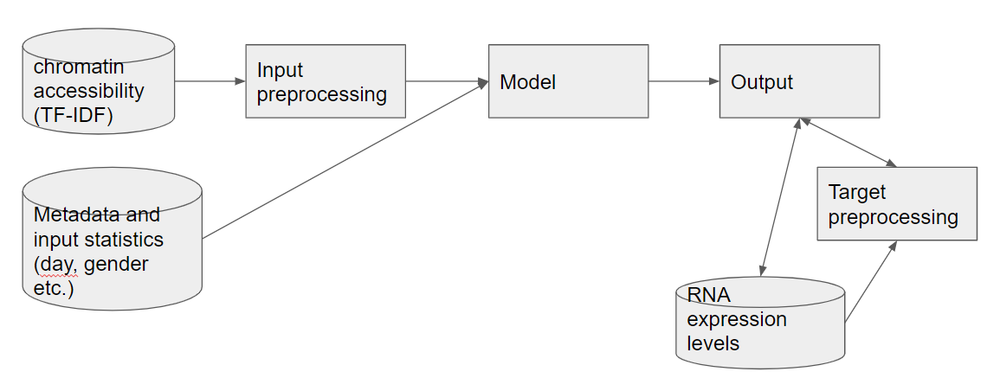

### Input Processing

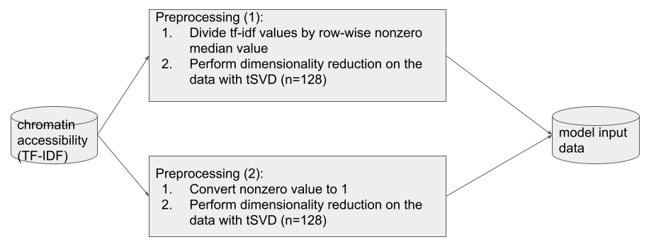

### Target Preprocessing

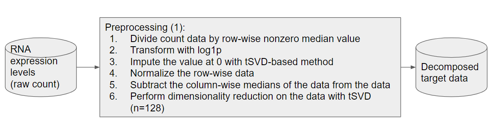

tSVD-based imputation method:

1.  Perform dimensionality reduction on the data with tSVD
2.  and then, Transform the data back to the original space
3.  copy the value of the 0 part of the original data from the
    transformed values.

### Model

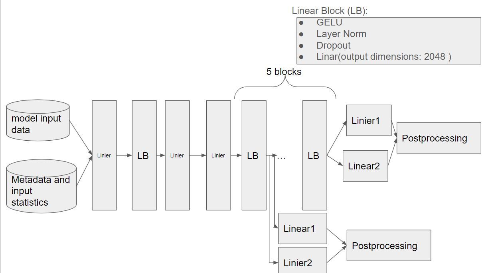

### Output Postprocessing and Loss

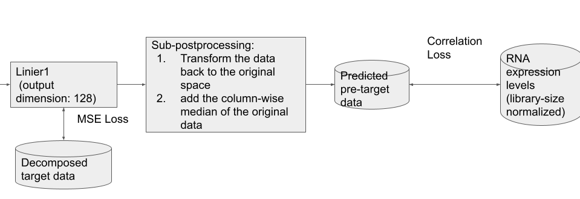

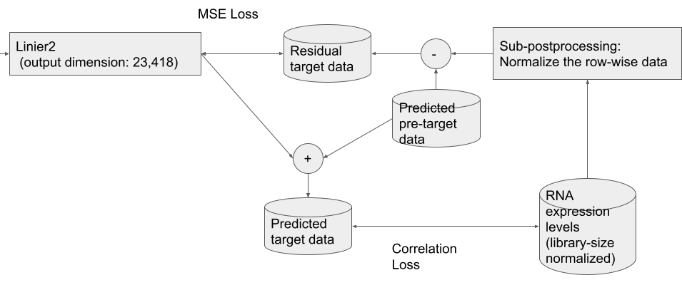

In the inference phase, the model outputs the average of the five
predicted target data.

## CITEseq

### Model Overview

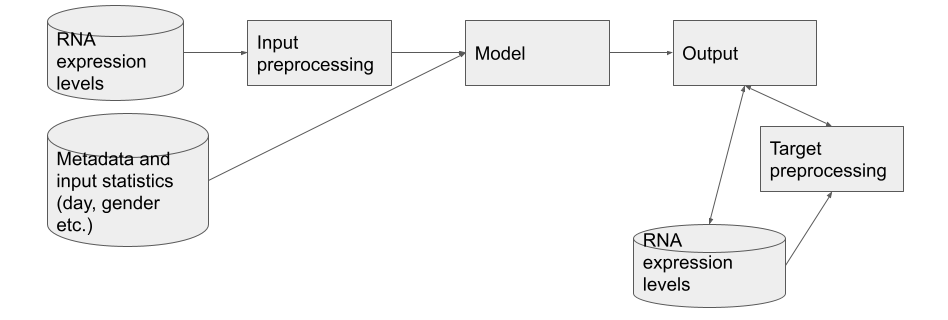

### Input Preprocessing

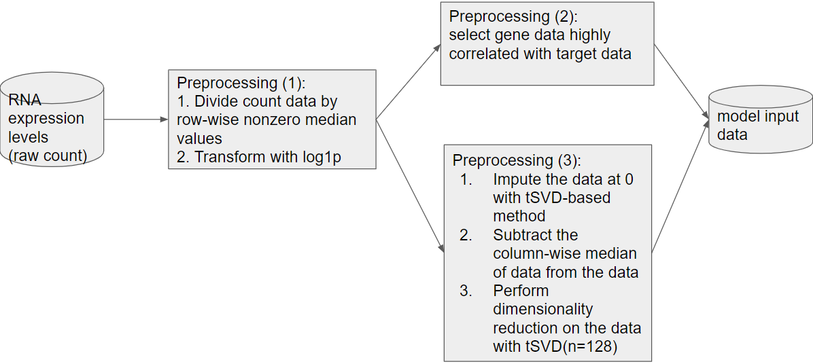

In selecting important genes in CITEseq, the correlation coefficient is
calculated for each batch and select only genes with high correlation in
many batches.

Genes were selected from those related to the target proteins and
pathway.

I use [Reactome](https://reactome.org/) as pathway database.

### Target Preprocessing

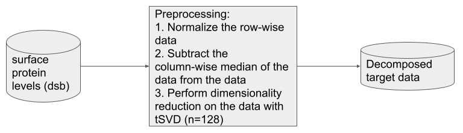

### Model

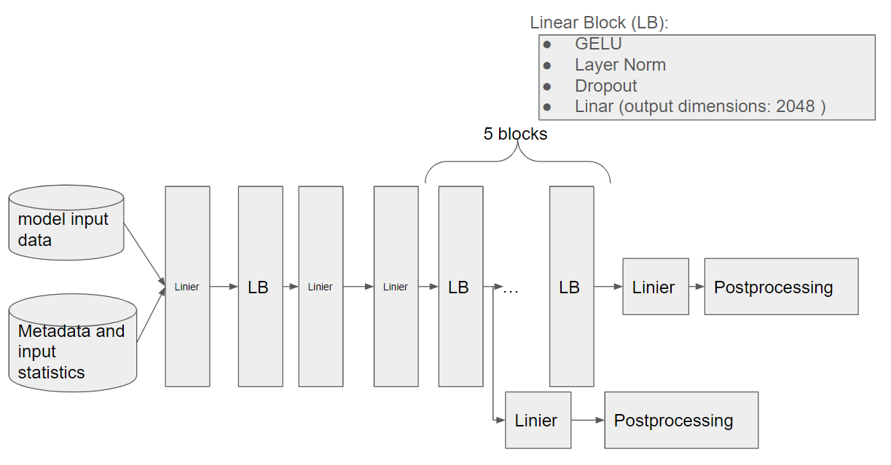

### Output Postprocessing and Loss

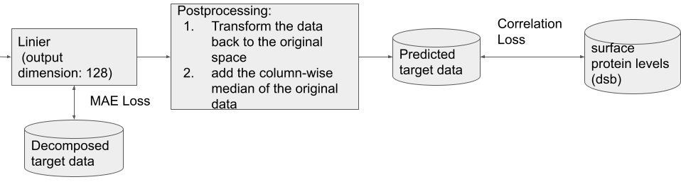

In the inference phase, the model outputs the average of the five
predicted target data.

## Local evaluation

I used two evaluation schemes.

1.  Evaluation with cross validation:
    - 5-fold cross validation grouped by donor and day
2.  Evaluation for hyperparameter optimization with Optuna:
    - Training data set is divided into training and validation data
      sets. ( Training data set: 80%, validation data set: 20%. )

## Ensemble

I used the weighted average of predictions of the following models.

1.  Models trained with changing the seed
2.  Models fine-tuned on only some batches
    - Batch combination pattern examples: males only, female only, Day
      4, 7 only, etc.
    - Use a model trained on the full training data set as a
      pre-training model
